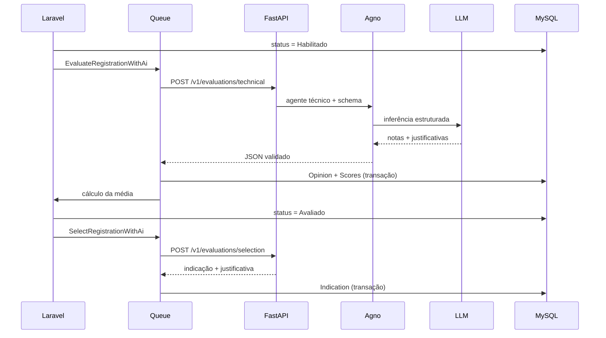

# Avaliação de inscrições por IA

## Arquitetura e domínio

O Laravel continua sendo a autoridade de dados e regras de negócio. O serviço Python não acessa o banco. A estrutura existente reutilizada é:

```text
Edition → Modality → Category → Registration
                           ├── EvaluationCriterion
                           ├── evaluators ↔ User
                           └── indicators ↔ User
Registration → Opinion → Score
Registration → Indication
Registration → AiExecution (auditoria técnica)
```

Uma alteração persistida para `Habilitado` dispara a avaliação técnica. O Laravel envia os cinco textos da proposta e os critérios da categoria, sem dados do candidato e sem pesos. Após validar integralmente a resposta, salva um `Opinion` e seus `Score` em transação e executa o cálculo Laravel existente. A transição resultante para `Avaliado` dispara, de forma independente, a seleção estratégica e salva uma `Indication` com `decision` e justificativa.



## Banco e auditoria

As migrations adicionam `rubric` JSON e `rubric_version` aos critérios, `decision` às indicações e criam `ai_executions`. Esta última registra correlação, tipo, status técnico, avaliador, artefato persistido, provedor/modelo, versões, tentativas, duração e erro. A restrição única por inscrição, avaliador, tipo e versão do prompt fornece idempotência. Não são armazenados tokens nem o conteúdo integral da proposta.

Cadastre dois usuários técnicos reais e use seus IDs nas configurações. O usuário técnico de avaliação pode também ser associado às categorias pela tabela `evaluators` para ficar coerente com as telas administrativas. Nenhum usuário é criado automaticamente, evitando inventar identidade ou credencial institucional.

## Configuração

Laravel (`.env`):

```dotenv
AI_EVALUATION_ENABLED=true
AI_SELECTION_ENABLED=true
AI_SERVICE_URL=http://127.0.0.1:8000
AI_SERVICE_TOKEN=<segredo-com-pelo-menos-32-caracteres>
AI_TECHNICAL_EVALUATOR_ID=<id-do-usuario-tecnico>
AI_SELECTION_EVALUATOR_ID=<id-do-usuario-selecionador>
AI_EVALUATION_TIMEOUT=60
AI_EVALUATION_TRIES=3
AI_EVALUATION_QUEUE=ai-evaluations
AI_KNOWLEDGE_VERSION=
```

FastAPI (`ai-service/.env`):

```dotenv
AI_SERVICE_TOKEN=<o-mesmo-segredo-configurado-no-laravel>
LLM_PROVIDER=openai
LLM_MODEL=<modelo-padrão>
AI_TECHNICAL_LLM_PROVIDER=
AI_TECHNICAL_LLM_MODEL=
AI_SELECTION_LLM_PROVIDER=
AI_SELECTION_LLM_MODEL=
OPENAI_API_KEY=
GEMINI_API_KEY=
LLM_TIMEOUT=45
KNOWLEDGE_VERSION=
KNOWLEDGE_MAX_CHARS=50000
```

Os overrides técnico e estratégico são opcionais e usam os valores globais quando vazios. Credenciais de provider pertencem exclusivamente ao serviço Python. Depois de alterar o Laravel, execute `php artisan config:clear`; depois de alterar o serviço Python, reinicie-o.

Os tempos padrão respeitam `LLM 45s < HTTP Laravel 60s < Job 70s < retry_after 90s`; o lock concorrente expira em 120s. Se qualquer timeout for alterado, preserve essa ordem.

## Execução

No diretório `ai-service`, crie um ambiente virtual, instale `requirements.txt` e inicie:

```bash
uvicorn app.main:app --host 127.0.0.1 --port 8000
```

Inicie o worker Laravel:

```bash
php artisan queue:work --queue=ai-evaluations --tries=3
```

Mantenha `DB_QUEUE_RETRY_AFTER` acima do timeout do job (por exemplo, `90` para o timeout padrão de `70` segundos) para impedir que um trabalho lento seja reservado duas vezes.

Os endpoints internos são `POST /v1/evaluations/technical` e `POST /v1/evaluations/selection`, autenticados por `Authorization: Bearer`. `/health` não executa inferência. OpenAI e Gemini são selecionados pela factory do serviço; ambos retornam o mesmo contrato institucional. O FastAPI anexa provider e modelo efetivamente usados, e o Laravel os registra em `ai_executions` sem confiar em configuração local.

## Prompts e conhecimento institucional

Os prompts versionados ficam em `app/prompts/technical_evaluator.py` e `app/prompts/selection_reviewer.py`. Alterações semânticas exigem nova constante de versão e atualização correspondente em `config/ai_evaluation.php`, preservando a auditoria/idempotência.

Somente documentos institucionais aprovados em `.md` ou `.txt` devem ser colocados em `ai-service/app/knowledge/documents`. Quando houver arquivos, `KNOWLEDGE_VERSION` torna-se obrigatória e o conteúdo é anexado aos dois prompts dentro do limite `KNOWLEDGE_MAX_CHARS`. Sem arquivos aprovados, nenhum conhecimento externo é injetado. O serviço não baixa conteúdo automaticamente.

A ausência de documentos é um estado válido e seguro. Nesse caso, mantenha `KNOWLEDGE_VERSION` vazia e preserve apenas o arquivo `.gitkeep`; os prompts versionados continuam sendo utilizados normalmente.

Para inscrições que já estavam habilitadas antes da ativação, primeiro simule e depois despache:

```bash
php artisan ai:evaluate-habilitados
php artisan ai:evaluate-habilitados --dispatch
php artisan ai:select-avaliados
php artisan ai:select-avaliados --dispatch
```

## Testes e teste manual

Testes não realizam chamadas reais ao LLM. Execute:

```bash
php artisan test --compact tests/Feature/AiEvaluationWorkflowTest.php
cd ai-service && PYTHONPATH=. pytest
```

Para um ensaio controlado, use uma inscrição fictícia em ambiente não produtivo, confirme os dois usuários técnicos e critérios, ative a flag, altere a inscrição para `Habilitado`, confira o job, rode o worker e inspecione `ai_executions`, `opinions` e `scores`. Confirme que `evaluation_avg` foi calculado pelo Laravel. Ao atingir `Avaliado`, confira o segundo job e a nova `indication`, sem mudanças nos scores anteriores.

Falhas HTTP, timeout, payload inválido ou nota fora da escala impedem persistência parcial e permitem retry do job. Após a última tentativa, a execução fica `failed`; o status de negócio da inscrição não é alterado pela falha. Consulte os logs pelo `correlation_id`, sem registrar proposta ou segredo. Para desativar imediatamente novas chamadas, defina `AI_EVALUATION_ENABLED=false` e limpe o cache de configuração.

| Erro | Retry | Comportamento |
|---|---:|---|
| 400/403/422 | não | execução falha com mensagem segura |
| 401 | não | `AI_UNAUTHORIZED` |
| versão/schema inválido | não | `AI_INVALID_RESPONSE` |
| timeout/conexão/408/429/5xx | sim | backoff de 15s, 60s e 180s |
| critérios alterados | não | `AI_CONFIGURATION_CHANGED`, sem parecer |
| status alterado | não | `AI_REGISTRATION_STATUS_CHANGED`, sem parecer |
| provider/model/chave ausente | não | `LLM_CONFIGURATION_ERROR`, sem expor credenciais |

Cada avaliação técnica usa um SHA-256 determinístico dos IDs, descrições, escalas e rubricas, sem incluir pesos. A idempotência no banco combina inscrição, avaliador, tipo, versão do prompt e esse fingerprint. Provider e modelo ficam na auditoria do resultado efetivo, mas não alteram essa identidade: uma troca de inferência não sobrescreve o parecer único já concluído; uma reavaliação deliberada exige nova versão institucional/configuração.

Em produção, endpoints remotos precisam usar HTTPS; HTTP é aceito somente para `localhost`, `127.0.0.1` ou `::1`. Os riscos de retenção permanecem sujeitos a decisão institucional: apagar uma inscrição remove `ai_executions`, e apagar um critério remove seus scores por cascade.
